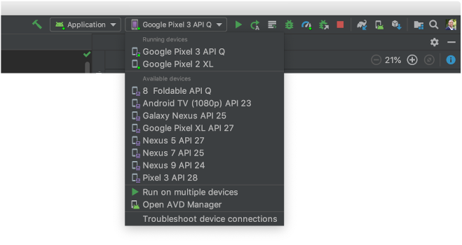
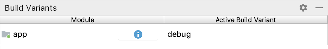
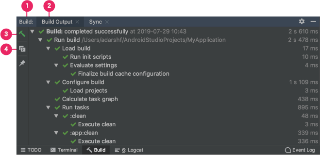
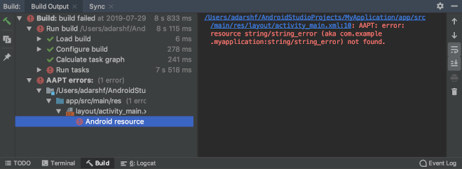

# Créez et exécutez votre application

Android Studio configure de nouveaux projets à déployer sur l'émulateur
Android ou un appareil connecté en quelques clics. Une fois votre
application installée, vous pouvez utiliser
[Apply Changes](https://developer.android.com/studio/run#apply-changes)
pour déployer certains changements de code et de ressources sans créer
un nouveau fichier APK.

Pour créer et exécuter votre application, procédez comme suit:

1. Dans la barre d'outils, sélectionnez votre application dans le menu
   déroulant des configurations d'exécution.
2. Dans le menu déroulant de l'appareil cible, sélectionnez l'appareil
    sur lequel vous souhaitez exécuter votre application.

Si aucun appareil n'est configuré, vous devez soit [connecter un appareil via USB](https://developer.android.com/studio/run/device#connect) ,  
soit [créer un AVD](https://developer.android.com/studio/run/managing-avds#createavd) pour utiliser l' [émulateur Android](https://developer.android.com/studio/run/emulator) .

3.  Cliquez sur **Run**  .

## Modifier la configuration d'exécution / débogage

Lorsque vous exécutez votre application pour la première fois, Android
Studio utilise une configuration d'exécution par défaut. La
configuration d'exécution spécifie si vous souhaitez déployer votre
application à partir d'un APK ou d'un
[Android App Bundle](https://developer.android.com/guide/app-bundle) ,
le module à exécuter, le package à déployer, l'activité à démarrer, le
périphérique cible, les paramètres de l'émulateur, les options de
logcat, etc.

La configuration d'exécution / débogage par défaut crée un fichier APK,
lance l'activité de projet par défaut et utilise la boîte de dialogue
**Sélectionner la cible de déploiement** pour la sélection du
périphérique cible. Si les paramètres par défaut ne conviennent pas à
votre projet ou module, vous pouvez personnaliser la configuration
d'exécution / débogage, ou même en créer une nouvelle, au niveau du
projet, par défaut et du module. Pour modifier une configuration
d'exécution / débogage, sélectionnez **Run > Edit Configurations** . Pour plus d'informations, voir [Créer et modifier des
configurations d'exécution / débogage](https://developer.android.com/studio/run/rundebugconfig)
.

## Changer la variante de construction

Par défaut, Android Studio crée la version de débogage de votre application,
 qui est destinée à être utilisée uniquement pendant le développement,
  lorsque vous cliquez sur <b>Run</b> .

Pour modifier la variante de build utilisée par Android Studio,
sélectionnez **Build > Select Build Variant** dans la barre de menus.

Pour les projets sans code natif / C ++, le panneau **Build Variants** a
deux colonnes: **Module** et **Active Build Variant** . La valeur
**Active Build Variant** pour le module détermine la variante de build
que l'IDE déploie sur votre appareil connecté et est visible dans
l'éditeur.

<b>Figure 1</b>. Le panneau <b>Build Variants</b> comporte deux colonnes pour
 les projets qui n'ont pas de code natif / C ++

Pour basculer entre les variantes, cliquez sur la cellule <b>Active Build Variant</b> active d'un module et choisissez la variante souhaitée
dans le champ de liste.

Par défaut, les nouveaux projets sont configurés avec deux variantes de
build: une variante de débogage et de publication. Vous devez créer la
variante de version pour [préparer votre application à une version
publique](https://developer.android.com/studio/publish/preparing) .

Pour créer d'autres variantes de votre application, chacune avec des
fonctionnalités ou des exigences d'appareil différentes, vous pouvez
[définir des variantes de construction supplémentaires](https://developer.android.com/studio/build/build-variants) .

## Construisez votre projet

Le bouton **Run**  crée et déploie
votre application sur un appareil. Cependant, pour créer votre
application à partager ou à télécharger sur Google Play, vous devrez
utiliser l'une des options du menu **Build** pour compiler des parties
ou la totalité de votre projet. Avant de sélectionner l'une des options
de build, assurez-vous de [sélectionner
d'abord la variante de build](https://developer.android.com/studio/run#changing-variant)
que vous souhaitez utiliser.

Pour plus de détails sur les tâches que Gradle exécute pour chaque
commande, ouvrez la fenêtre **Build** comme décrit dans la section
suivante. Pour plus d'informations sur Gradle et le processus de build,
voir
[Configurer votre build](https://developer.android.com/studio/build) .

## Surveillez le processus de construction

Vous pouvez afficher des détails sur le processus de build en cliquant
sur **View > Tool Windows > Build** (ou en cliquant sur **Build**
 dans la barre de la
fenêtre d'outils). La fenêtre affiche les tâches que Gradle exécute afin
de créer votre application, comme illustré dans la figure 3.

<b>Figure 3</b>. La fenêtre de sortie Build dans Android Studio

1. **Onglet Build**: affiche les tâches que Gradle exécute sous forme
   d'arborescence, où chaque nœud représente soit une phase de build
   soit un groupe de dépendances de tâches. Si vous recevez des erreurs
   au moment du build ou de la compilation, inspectez l'arborescence et
   sélectionnez un élément pour lire la sortie d'erreur, comme le montre
   la figure 4.

<b>Figure 4</b>. Inspectez la fenêtre de sortie Build pour les messages d'erreur

2. **Onglet Sync**: affiche les tâches que Gradle exécute pour
   synchroniser avec vos fichiers de projet. Semblable à l' onglet
   **Build** , si vous rencontrez une erreur de synchronisation,
   sélectionnez des éléments dans l'arborescence pour trouver plus
   d'informations sur l'erreur.
3. **Redémarrer**: exécute la même action que la sélection de **Build>
   Make Project** en générant des fichiers de build intermédiaires pour
   tous les modules de votre projet.
4. **Basculer la vue**: bascule entre l'affichage de l'exécution de
   tâches sous forme d'arborescence graphique et l'affichage d'une
   sortie de texte plus détaillée à partir de Gradle — c'est la même
   sortie que vous voyez dans la fenêtre de la **console Gradle**
    sur Android
   Studio o 3.0 et versions antérieures.

Si vos variantes de build utilisent des versions de produit (flavors),
Gradle appelle également des tâches pour créer ces versions de produit.
Pour afficher la liste de toutes les tâches de construction disponibles,
cliquez sur **View > Tool Windows > Gradle** (ou cliquez sur **Gradle**
 dans la barre de la
fenêtre d'outils).

Si une erreur se produit pendant le processus de génération (build), Gradle peut
 recommander certaines options de ligne de commande pour vous aider à
  résoudre le problème, telles que --stacktrace ou --debug. Pour utiliser
   les options de ligne de commande avec votre processus de génération:

1.  Ouvrez la boîte de dialogue **Settings** ou **Preferences** :
    - Sous Windows ou Linux, sélectionnez **File > Settings** dans la barre de menus.
    - Sous Mac OSX, sélectionnez **Android Studio > Preferences** dans la
      barre de menus.
2.  Accédez à **Build, Execution, Deployment > Compiler** .
3. Dans le champ de texte à côté de Options de ligne de commande ,
 entrez vos options de ligne de commande.
4. Cliquez sur **OK** pour enregistrer et quitter.

Gradle applique ces options de ligne de commande la prochaine fois que
 vous essayez de créer votre application.

