# L'application Go4Lunch

L’application Go4Lunch est une application collaborative utilisée par tous les employés.
 Elle permet de rechercher un restaurant dans les environs, puis de sélectionner celui de
 son choix en en faisant part à ses collègues. De la même manière,il est possible de consulter les
 restaurants sélectionnés par les collègues afin de se joindre à eux. Un peu avant l’heure du
 déjeuner, l’application notifie les différents employés pour lesinviter à rejoindre leurs collègues.

## Aperçu de l' application

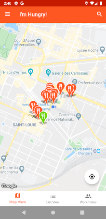 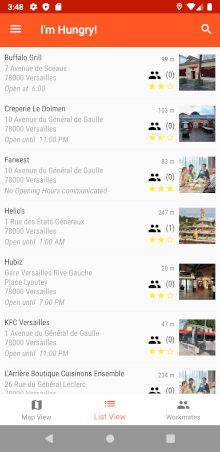
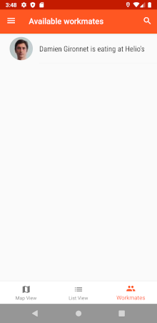 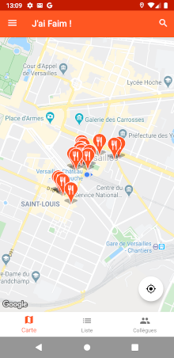
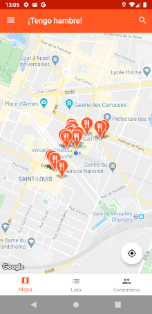 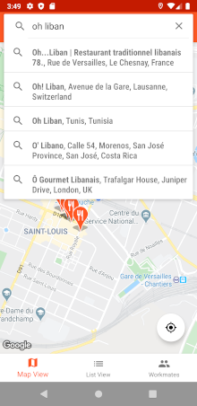
 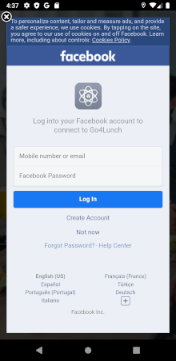
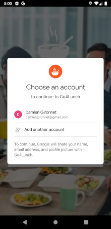 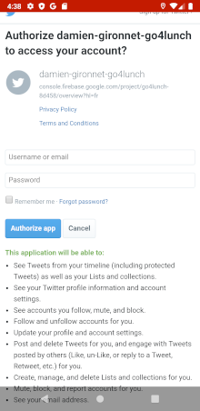
  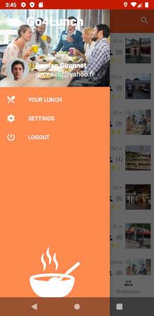 
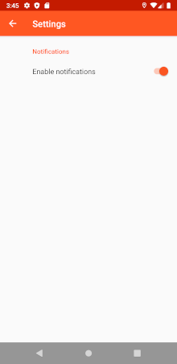  
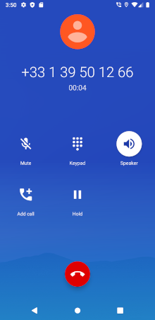 
 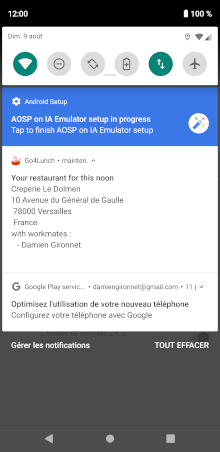

## Ressources :

### Firebase :
Firebase est un ensemble de services d'hébergement pour n'importe quel type d'application. Il propose d'héberger en NoSQL et en temps réel des bases de données, du contenu, de l'authentification sociale, et des notifications, ou encore des services, tel que par exemple un serveur de communication temps réel.
- [firebase authentication](https://firebase.google.com/docs/auth)
- [firebase firestore](https://firebase.google.com/docs/firestore)
- [firebase cloud functions](https://firebase.google.com/docs/functions)

### Android :
Principales dépendances Android utilisées dans le développement de l'application.
- [android room](https://developer.android.com/topic/libraries/architecture/room)
- [retrofit](https://square.github.io/retrofit/)
- [architecture components](https://developer.android.com/topic/libraries/architecture)
- [android viewmodel](https://developer.android.com/topic/libraries/architecture/viewmodel)
- [android livedata](https://developer.android.com/topic/libraries/architecture/livedata)
- [rxjava 2.x](https://github.com/ReactiveX/RxAndroid/tree/2.x)
- [androidx](https://developer.android.com/jetpack/androidx)
- [butterknife](https://jakewharton.github.io/butterknife/)
- [android material design](https://material.io/develop/android)
- [glide](https://github.com/bumptech/glide)

### Authentication :
Liens vers les documentations Facebook et Twitter nécessaires à l'application.
- [facebook login](https://developers.facebook.com/docs/facebook-login/android/)
- [twitter login](https://developer.twitter.com/en/docs/basics/authentication/guides/log-in-with-twitter)

### Google Api : 
Apis Google utilisé pour accéder aux données des emplacements environnant.
- [google place api](https://developers.google.com/places/web-service/overview)
- [google map api](https://developers.google.com/maps/documentation/android-sdk/intro)
- [google place autocomplete](https://developers.google.com/places/web-service/autocomplete)

### UI Testing :
dépendances utilisées pour le développement des tests instrumentés.
- [espresso](https://developer.android.com/training/testing/espresso)
- [uiautomator](https://developer.android.com/training/testing/ui-automator)
- [android test orchestrator](https://developer.android.com/training/testing/junit-runner#using-android-test-orchestrator)
- [mockito](https://site.mockito.org/)
- [robolectric](http://robolectric.org/)

### Unit Testing :
dépendances utilisées pour le dépendances des tests unitaires.
- [retrofit mock](https://github.com/square/retrofit/tree/master/retrofit-mock)
- [google truth](https://github.com/google/truth)

### Logging :
dépendances utilisées pour gérer les logs de l'applications.
- [timber](https://github.com/JakeWharton/timber)

